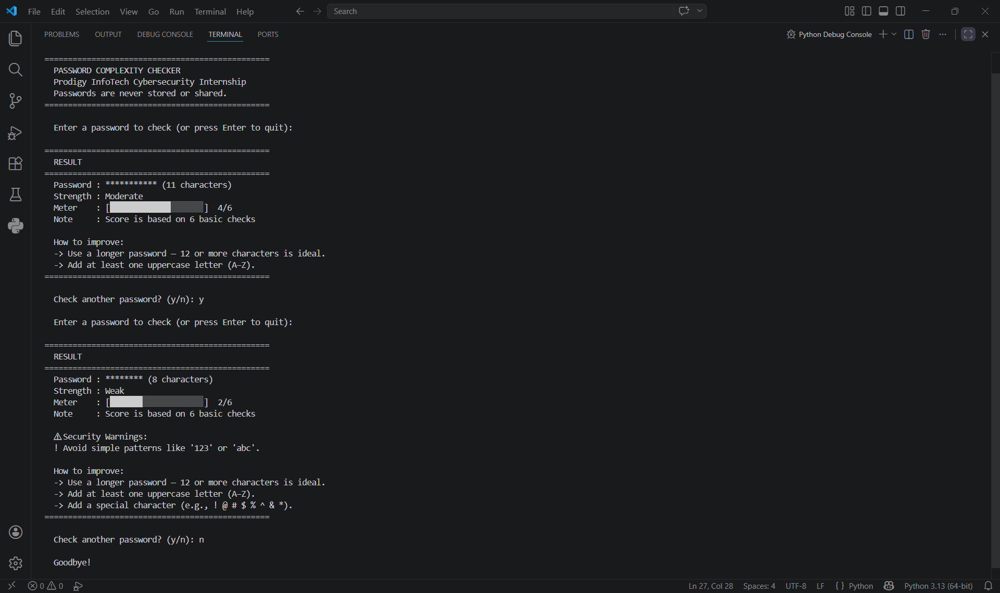

# 🔐 PRODIGY_CS_03 — Password Complexity Checker

> Task 03 | Prodigy InfoTech Cybersecurity Internship

---

## 📌 Overview

This project is a **Password Complexity Checker** built using Python.  
It evaluates the strength of a password based on common security criteria and basic pattern detection.

The tool assigns a **score (0–6)** and provides feedback to help users create stronger and more secure passwords.

---

## 🧠 Features

- ✅ Hidden password input using `getpass`
- ✅ Strength scoring system (0–6 scale)
- ✅ Visual strength meter
- ✅ Basic security checks:
  - Password length
  - Uppercase and lowercase letters
  - Numbers
  - Special characters
- ✅ Detection of weak patterns:
  - Common passwords (e.g., "123456", "password")
  - Repeated characters (e.g., "aaa", "111")
  - Simple sequences (e.g., "abc", "123")
- ✅ Suggestions for improving weak passwords
- ✅ Security warnings for risky inputs

---

## ⚙️ How It Works

### 1. Basic Scoring

The password is evaluated based on 5 criteria:

- Length (8+ / 12+ characters)
- Uppercase letters (A–Z)
- Lowercase letters (a–z)
- Numbers (0–9)
- Special characters (!@#$%^&*)

Score is calculated out of **6 points**.

---

### 2. Security Checks

The tool reduces the score if risky patterns are detected:

- ❌ Common passwords → score reset to 0
- ❌ Repeated characters → penalty applied
- ❌ Sequential patterns → penalty applied

---

### 3. Strength Levels

| Score | Strength   |
|------|----------|
| 0 – 2 | Weak     |
| 3 – 4 | Moderate |
| 5 – 6 | Strong   |

---

## 🚀 How to Run

```bash
python password_checker.py
```

---

## 💻 Example Output

```
================================================
  RESULT
================================================
  Password : ******** (8 characters)
  Strength : Moderate
  Meter    : [██████████░░░░░░░░░░]  3/6

  ⚠ Security Warnings:
  ! Avoid simple patterns like '123'

  How to improve:
  -> Add a special character (e.g., ! @ # $ % ^ & *)
================================================
```

---

## 📸 Output Screenshot



---

## 📁 Project Structure

```
PRODIGY_CS_03/
│
├── password_checker.py
├── README.md
└── output.png
```

---

## ⚠️ Important Notes

- Passwords are **not stored or transmitted**
- All checks are performed locally
- This tool is for **educational purposes**
- Strong passwords should:
  - Be at least 12 characters long
  - Use a mix of character types
  - Avoid predictable patterns

---

## 👨‍💻 Author

**Anjali Kunwar Simari**  
Cybersecurity Intern @ Prodigy InfoTech  

---

## 🏷️ Tags

`#Cybersecurity` `#Python` `#PasswordSecurity` `#ProdigyInfoTech`
